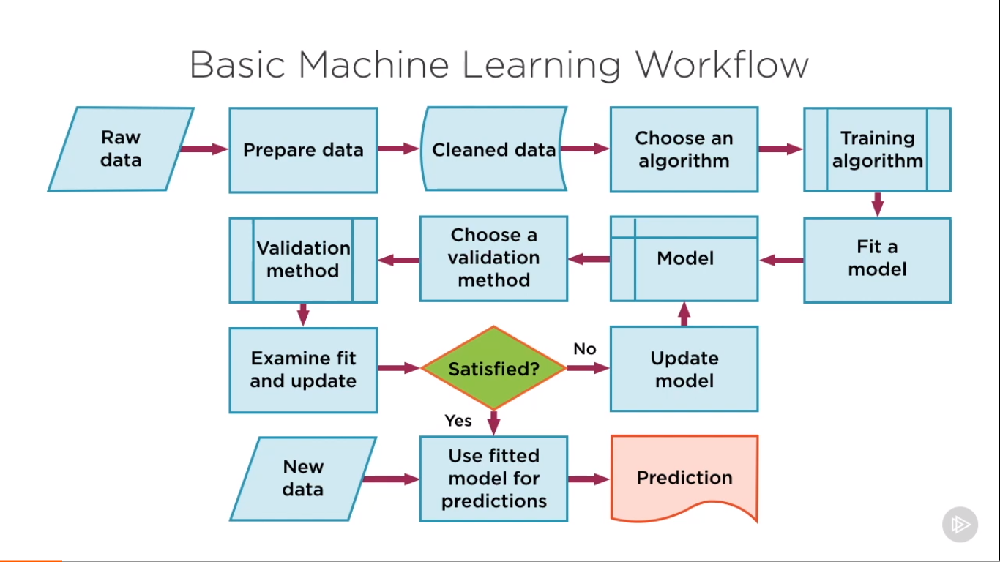

# Machine Learning
A machine learning algorithm is an algorithm that is able to learn from data.

**Categories**:
1. Classification (is this email spam or ham ? is this review sentiment positive or negative) is used to predict categories and classes.
2. Regression ( predict continuos values. What the price of this house? price off a stock today and you have the earning reports what will the stock prioce tomorrow?)
3. Clustering (When you have large amount of data and no assigned labels.) clustering is used to do find the logical patterns and groupings in your data.
4. Dimensionality reduction (Large amount of data but not all of it significant. How do you extract latent features that existing your data ? how do you find the common drivers for 200 stocks.)

# Rule-based vs. ML-based Learning:

* Static (Rule based analysis works extremley well when the problem statement that you are dealing with is fairly simple.)
Rules are straight forward and can be easily codified.
Rules change infrequently.
Few problem instances to train ML models.

Where ML 
* Dynamic (Problem statement is reasonably complex.)- output based on patterns in data.
* Hard to find the pattern using visulization and other exploratory tools. well ml is probably what you need to go for 
* Decision variables sensitive to data need to change as new information is recevied.
* huge corpus of data available to train models.

## Traditional ML models vs Representation ML models.
**Traditional ML models**
Traditional ml models require experts to specify the right features.
1. Regression Models: Linear, Lasso, Ridge, SVR
2. Classification Models: Naive bayes, SVMs, kNN, Decission tree, Random forests.
3. Dimensionality Reduciton: Manifold learning, factor analysis.
4. Clustering: K-means, DBSCAN, Spectral clustering.

**Representation Ml models**
Representation Ml models extract the right features by themselves. (Neural networks)
Also used to solve classification, clustering, regression, dimensionality reduction.

## Basic Machine Learing Workflow:


## Choosing The Rigth Model Based On Data:

Classification you will use when you want to classify your input data into categories.

    * Predict categories (Email-> spam or ham)
    * Stocks: Buy sell, or hold
    * Images: Cat, dog or mouse.
    * Sentiment analysis

Regression Model you will use when you predict continuous numeric values.

    * Given past stock data predict the price of tomorrow
    * Given characteristics of a car predict mileage
    * Given loacation and attributes of a home predict price.

Clustering :

    * Is often used to DOcument discovery- find all document related to homicide cases.
    * Social media ad targeting - find all users who are interested in sports like that.

Dimensionality Reduciton involves extracting significant features that exist in your data.

    * Preprocess data to build more robust machine learning models. 

```
Image-data: Convolution Neural Networks
Complex Textual Data: Recurrent Neural Networks.
Sequential or time series data: Recurrent Neural Networks.

Linear X-variables: linear and logistic regression, PCA

Large numebr of x-variables: Decision trees.

```

## Supervised and Unsupervised:
Supervised :
* Label associated with the training data is used to correct the algo.
* input variable x and ouput variable is y
* learn the mapping funciton y=f(x)
* Using existing dataset to correct our mapping funcition approximation. 

Unsupervised Learning learns the pattern from the data without a labeled corpus.
* The model has to be set up right to learn structure in the data.

```py
# When use which map
import seaborn as sns
import matplotlib.pyplot as plt

# Correlation - > 'Heatmap'
correlation = df.corr()
sns.heatmap(correlation, annot=True)
plt.show()

# Categorical variable (like diamond cut-> fair, good, premium, ideal) -> boxplot
df.boxplot(by="cut", column=['price'], grid=False, figsize=(10,8))

## continuos data ->  scatter plot
plt.scatter(df['carat'],df['price'])
```
